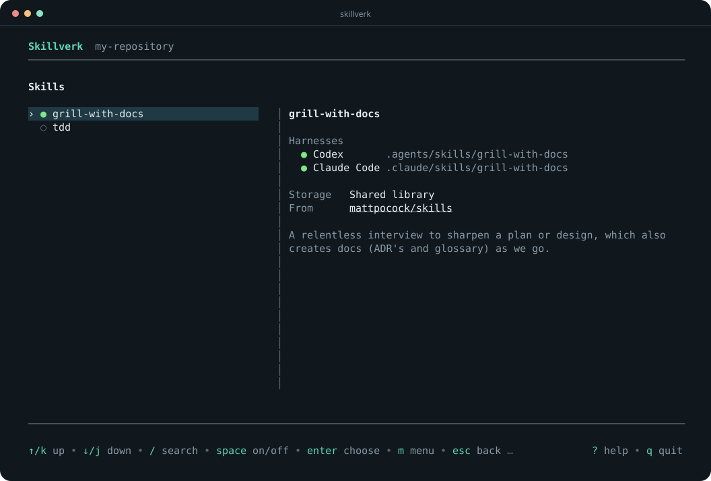

# Skillverk

Keep your agent skills in one library and choose which ones each repository
uses, across your coding agents.

> [!NOTE]
> This project is mostly AI-generated. The use case, UI design, and taste are
> mine. I used Fable 5.1 and GPT-6 Astra for the implementation. If you don't
> like that, use something else.

<p align="center">
  
</p>

## Install

macOS and Linux:

```sh
curl -LsSf https://raw.githubusercontent.com/CyberStefNef/skillverk/main/scripts/install.sh | sh
```

Windows:

```powershell
powershell -c "irm https://raw.githubusercontent.com/CyberStefNef/skillverk/main/scripts/install.ps1 | iex"
```

You can also download a binary from the
[releases page](https://github.com/CyberStefNef/skillverk/releases). Requires Git.

## Quick start

```sh
skillverk add mattpocock/skills  # import skills into your library
cd ~/work/my-repository
skillverk                      # choose skills for this repository
```

Use the arrow keys to browse and Space to turn a skill on or off. Press `/` to
search, `m` for the menu, and `?` for help.

Import from Git repositories, local folders, or archives. Update a shared skill
once and every repository using it gets the change.

## Setup and migration

Already have skills installed? The setup skill helps you review them and move
reusable ones into Skillverk. Install it with:

```sh
skillverk setup --install-companion
```

Start a new Codex or Claude Code session and ask:

> Use the skillverk-setup skill to review my existing skills in ~/code and
> recommend what to move into Skillverk.

The agent checks your installations and proposes a migration. You approve the
changes before it moves anything.

You can also launch an agent review directly, or review the skills yourself:

```sh
skillverk setup --provider codex ~/code  # or --provider claude
skillverk setup ~/code                  # review in Skillverk
```

## Use the CLI

```sh
skillverk list
skillverk on review
skillverk off review
skillverk update review
skillverk agents opencode,cursor
```

Run `skillverk --help` for all commands, or add `--help` to a command for examples.

See [compatibility](docs/compatibility.md) for supported agents and import formats,
and [contributing](CONTRIBUTING.md) for development and release instructions.

[MIT license](LICENSE).
